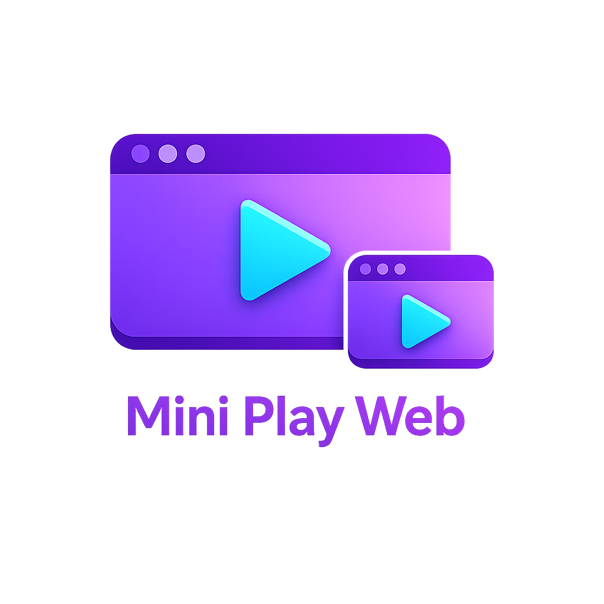

# Mini Play Web

Browser extension untuk memutar video dalam mode mini player / floating window. Video tetap visible saat pindah tab atau minimize browser.

## Installation

## Features

- **Native Picture-in-Picture (PiP)** - Video tetap visible di layar meski browser di-minimize / buka aplikasi lain
- **In-page Overlay Mode** - Floating player di dalam halaman, draggable & resizable
- **Auto-detect Tab Switch** - Otomatis aktifkan mini player saat tab video lose focus
- **Universal Video Support** - Support semua situs dengan HTML5 video
- **Navigation Controls** - Tombol Next/Prev untuk navigasi video feed
- **Feed Video Support** - Auto-detect video berubah saat scroll (YouTube Shorts, TikTok, IG Reels)
- **Cross-browser** - Chrome, Edge (Manifest V3) + Firefox (Manifest V2)

## Installation

### Chrome / Edge

1. Buka `chrome://extensions/`
2. Aktifkan **Developer mode** (toggle pojok kanan atas)
3. Klik **Load unpacked**
4. Pilih folder project `mini-play-web`
5. Extension muncul di toolbar

### Firefox

1. Buka `about:debugging#/runtime/this-firefox`
2. Klik **Load Temporary Add-on**
3. Pilih file `manifest-v2.json` di folder project
4. Extension aktif

## Usage

1. Buka situs video (YouTube, TikTok, dll)
2. Play video
3. Pindah tab atau minimize browser
4. Video otomatis muncul dalam mode PiP (atau overlay, sesuai settings)
5. Klik icon extension untuk toggle manual atau ganti mode

### Navigation

- Klik tombol **Prev** untuk scroll ke video sebelumnya
- Klik tombol **Next** untuk scroll ke video berikutnya
- Works di YouTube Shorts, TikTok, Instagram Reels, dll

## Settings

Klik icon extension → **Settings** untuk konfigurasi:

| Setting | Description | Default |
|---|---|---|
| **Mode** | PiP / Overlay / Manual / Off | PiP |
| **Overlay Size** | Small (200px) / Medium (300px) / Large (400px) | Medium |
| **Overlay Position** | Bottom-right / Bottom-left / Top-right / Top-left | Bottom-right |
| **Navigation** | Tampilkan tombol Next/Prev | On |
| **Auto-activate** | Aktifkan saat tab switch | On |
| **Show on hover** | Tampilkan kontrol saat hover (overlay) | On |

## Supported Sites

- YouTube / YouTube Shorts
- TikTok
- Instagram Reels
- Twitch
- Bilibili
- Vimeo
- Dan semua situs dengan HTML5 video

## Supported Browsers

| Browser | Support |
|---|---|
| Chrome | ✅ Manifest V3 |
| Edge | ✅ Manifest V3 |
| Firefox | ✅ Manifest V2 |
| Safari | ❌ Not supported |

## Contributing

1. Fork repository ini
2. Buat feature branch (`git checkout -b feature/my-feature`)
3. Commit perubahan (`git commit -m 'feat: add my feature'`)
4. Push ke branch (`git push origin feature/my-feature`)
5. Buat Pull Request

### Commit Convention

Kami menggunakan [Conventional Commits](https://www.conventionalcommits.org/):

- `feat:` - New feature
- `fix:` - Bug fix
- `docs:` - Documentation
- `style:` - CSS/style changes
- `refactor:` - Code restructuring
- `test:` - Adding tests
- `chore:` - Build, config, tooling

## License

[MIT License](LICENSE)

## Credits

- Browser Extension APIs (Chrome, Firefox)
- Picture-in-Picture Web API
